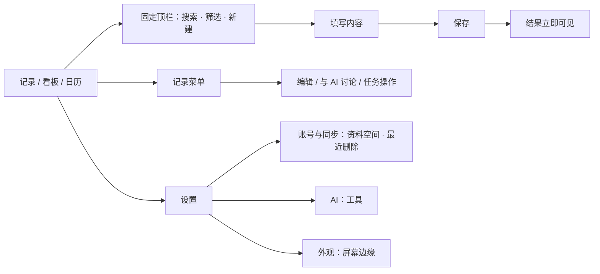

# Noto UI/UX 减法设计

2026-09-13。本次覆盖 macOS 主窗口、记录录入、任务看板、日历、AI 对话、设置与屏幕边缘。

## 统一规则

- 导航只切换内容；新建、搜索和筛选有固定位置。
- 「记录 / 任务 / 对话」各有清楚含义；操作统一为新建、保存、取消、完成、重新打开和恢复。
- 颜色表达选择、状态和操作，不为导航项目各分配一种颜色。
- 阅读和编辑使用实底；侧栏和屏幕边缘保留系统玻璃。卡片用来组织任务，不包裹每段普通正文。
- 常用操作直接可见，次要操作进入所属记录的菜单。低频说明不独占一个设置页面。
- 内容创建或修改后，要能立刻找到结果。错误保持可见，成功提示短暂出现；撤销继续可从菜单和快捷键使用。

## 具体减法

| 范围 | 原来 | 调整后 |
| --- | --- | --- |
| 主窗口 | 彩色图标、应用名和常驻快捷键文字 | 单色图标、简短导航与选择状态 |
| 看板新建 | 侧栏、页内工具栏和两列列头，共四处 | 统一到顶栏一个新建入口 |
| 看板标题 | 「看板」下再出现「全部任务」 | 一层页面标题 |
| 窄看板 | 横向滚动才能找到另一种状态 | 单列阅读，三种状态直接切换；状态入口同时接受拖放 |
| 宽看板 | 各列重复操作工具 | 三列只保留标题、数量和任务 |
| 完成任务 | 记录用方框，日历用圆形，看板需菜单 | 三个 Mac 视图共用圆形完成按钮 |
| 新建任务 | 新建时隐藏状态，编辑时才显示 | 在填写时直接选择状态，保存后窄看板显示对应列 |
| 记录列表 | 每条重复时间、较大的包裹背景 | 正文优先，必要时显示任务元信息；时间保留在正文提示中 |
| 对话 | 独立的文字层级和消息背景 | 与主窗口共用字阶和实底；明确的发送按钮 |
| 设置 | 四个主题、重复标题、返回和关闭两个出口 | 三个主题：账号与同步、AI、外观；一个关闭入口 |
| 屏幕边缘设置 | 开关与展开方式两套控制 | 一个三态选择：悬停展开、始终展开、隐藏 |
| 最近删除 | Mac 通用页 | 统一归入账号与同步 |
| 成功反馈 | 长期占用阅读区底部 | 5 秒后收起；错误不自动消失 |

保留现有记录、任务三态、重要标记、日期、搜索、对话、恢复、同步和 CLI 数据能力。已确认的 Codenotch 玻璃轮廓与吸附交互保持，边缘文案跟随主窗口统一。

## 路径

## 本次检查

| 步骤 | 当前结果 | 验证方式 |
| --- | --- | --- |
| 1. 浏览记录 | 正文、元信息、操作分层清楚；移除重复背景与时间 | 本次原生截图，浅色紧凑与深色宽窗口 |
| 2. 浏览看板 | 紧凑状态切换与宽窗口三列正常 | 本次原生截图与实际切换 |
| 3. 新建任务 | 进行中任务保存后自动进入进行中列 | 原生新建、选择状态、保存与结果截图 |
| 4. 完成任务 | 一次点击完成，无额外编辑弹窗；已完成列可找到任务 | 原生操作与结果截图 |
| 5. 记录录入 | 修复浮层底下文字透出的问题，实底复查通过 | 修复前后原生截图 |
| 6. 日历与对话 | 顶栏与字阶一致，入口正常 | 深色原生日历、记录菜单与对话截图 |
| 7. 设置与恢复 | 三个主题，恢复入口归入账号与同步 | Mac 原生截图 |

Mac 截图由本次 Computer Use 捕获，位于本任务工具输出，工具未提供本地截图路径。紧凑窗口约 620×700pt，宽窗口 1340×954pt，设置最终为 620×480pt。没有用旧任务截图替代本次结果。

## 验证范围

- Mac：58 项自动化测试，0 失败、1 条外部条件测试跳过。最终应用构建与签名验证通过。
- 真实 AI 回复、真实账号云同步、多显示器与全屏吸附未重新现场联调。
- Mac 手工操作使用内存示例实例。没有用验收内容写入个人资料。

final result: passed
