# Noto 端到端设计与验收

2026-09-12。依据原始任务对话、当前源码与本轮原生截图重设计；设计契约见 [E2E-UX.md](../E2E-UX.md)。以下截图来自本轮隔离 Noto 应用，数据为自建样例。没有把用户本机个人内容送入测试对话。

## 流程结论

| 步骤 | 设计与操作 | 验证结果 |
| --- | --- | --- |
| 1. 进入与阅读 | 统一“记录”命名，日期短横线与日期锚点，单图标切换，本机/账号入口 | 宽屏浅色、620pt 深色原生查看通过 |
| 2. 捕获与保存 | 浮动输入，保存小记、菜单存为任务；新建清除隐藏新内容的筛选 | ⌘N、输入、⌘↵ 小记和菜单存任务通过；筛选回归通过 |
| 3. 整理与安排 | 原位编辑、三态、重要、日期快捷项；看板/日历共享任务 | 原位编辑→明天→保存、看板/日历结果通过；拖拽本轮未验收 |
| 4. AI 持续对话 | 原记录启动；默认当前记录、显式范围；可收起的执行过程 | 真实 OpenCode 两轮：普通记录→重要任务→明天/进行中，通过 |
| 5. 查找与回看 | 搜索包含完整对话，窄屏对话返回记录 | 仅 AI 回答出现的“重要标记保持不变”命中原任务，返回路径通过 |
| 6. 删除、恢复与空间 | 设置/编辑菜单最近删除，明确本机与账号；高级配置折叠 | 删除含对话任务→退出进程→重启→恢复，通过；登录与公网同步未实测 |
| 7. iPhone | 筛选原生菜单、三态日期、草稿保护、重启恢复 | 两条离线 UI tests 通过；新增筛选下创建可见性单独重跑通过；真实后端用例跳过 |

## 关键检查与修复

普通记录原先不能直接发起首轮对话，Core appendQuestion 现在在同一事务中为原记录启用对话并插入消息，保留 ID、正文、任务属性与时间。无效 ID、空输入不写入。每轮 AI 请求前刷新该记录，避免上一轮转换或外部 CLI 修改后持续使用旧快照；运行期间仍按读取快照拒绝覆盖。

最近删除沿用既有归档表，无数据库迁移；按归档插入次序展示，不声称具体删除时间。恢复统一清除“上次删除”指针，避免恢复后还显示无效操作。恢复浮层期间禁用背后视图的新增/保存/撤销快捷键，避免提交被遮住的草稿。

新建时，旧搜索或重要筛选可能隐藏刚创建的内容。Mac 和 iPhone 均在保存成功后调整相关筛选，使新内容可见；不会在保存失败时清除输入。

## 自动化与产物

- `swift test`：52 项，1 项 live sync 因未提供配置跳过，0 失败。[日志](swift-tests.log)
- `zsh scripts/build.sh`：release 构建及 ad-hoc 签名验证成功。[日志](build.log)
- `python3 scripts/verify-cli.py`：状态、重要、日期、转换、幂等、搜索、导出等 CLI 契约通过。[日志](cli.log)
- iPhone 17 模拟器 UI 测试：3 项中 2 项离线通过、1 项真实服务用例跳过；筛选创建用例再单独运行通过。[整轮日志](ios/tests.log)、[新增回归](ios/filter-create-test.log)
- 独立 CLI 导出核验：恢复后的「整理周末的想法」仍为 todo / in_progress / important / 2026-09-13，原 ID 下 4 条历史消息（2 问2答）。[导出](qa-export.json)
- 原生测试应用：`/private/tmp/Noto-E2E.app`，独立数据：`/private/tmp/noto-e2e-20260912.sqlite`。正式构建：`build/Noto.app`。

## 截图与具体观察

### 1. 记录

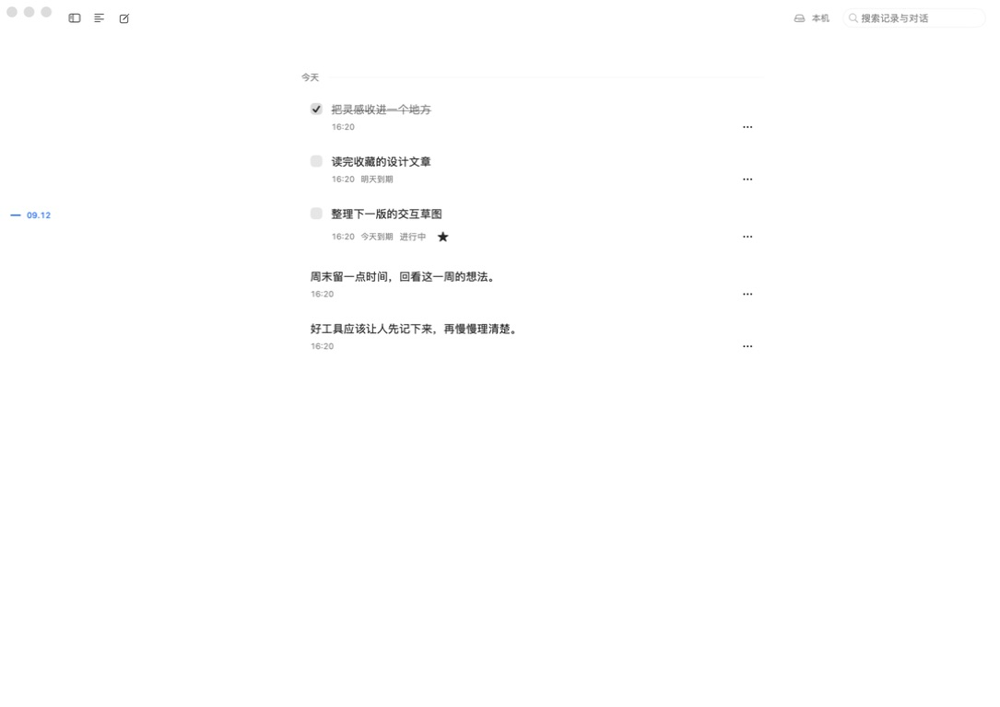

命名与内容类型相符，日期锚点回到短横线加日期；无新增横向白色工具栏。保留系统色和现有正文宽度。键盘可达性依赖原生菜单与辅助功能标签，完整 VoiceOver 尚未检查。

### 2. 按需输入

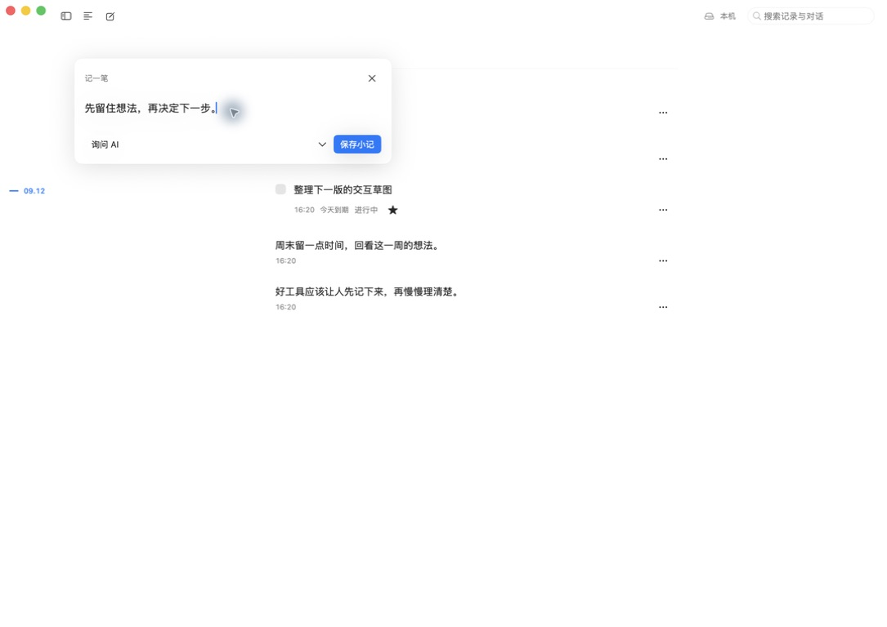

默认主动作明确为“保存小记”，其他保存方式收在相邻菜单，AI 保持次级。真实操作已保存一条小记，并从同一输入菜单保存任务。收起保留进程内草稿；不承诺退出应用后恢复草稿。

### 3. 任务、日期与编辑

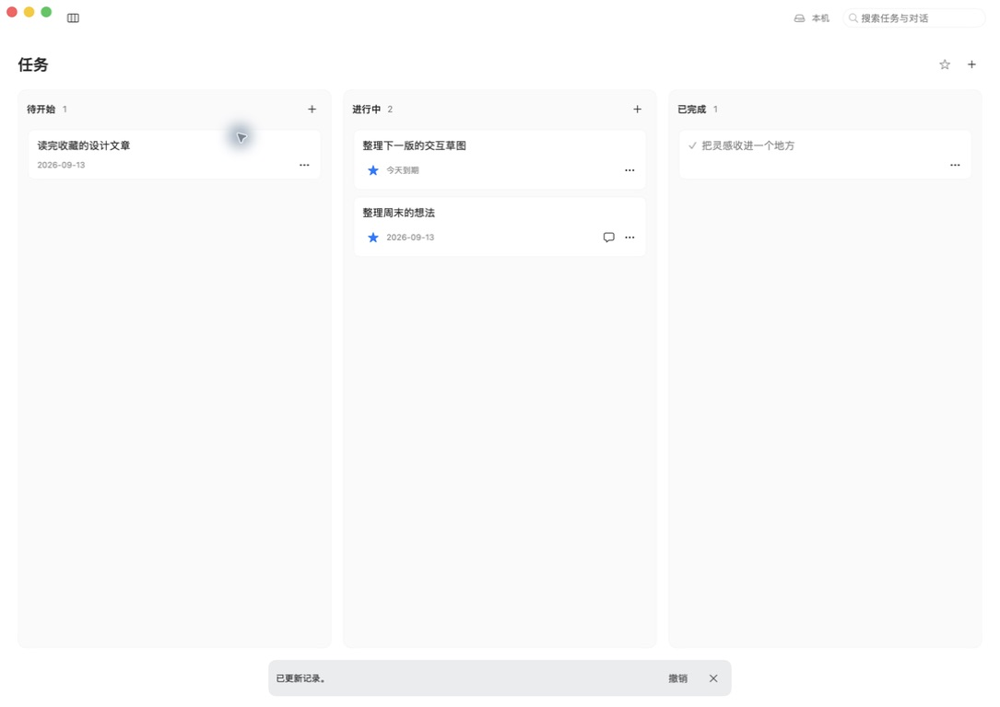

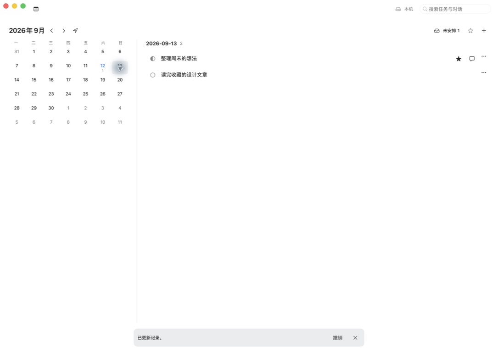

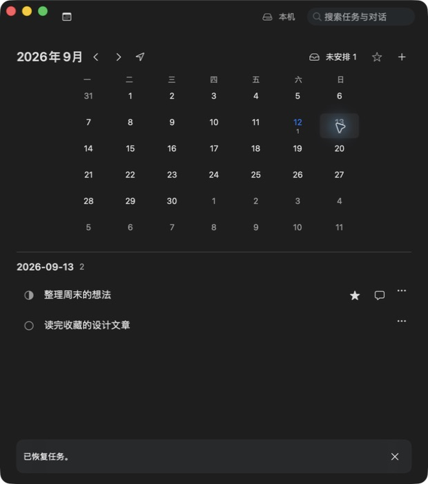

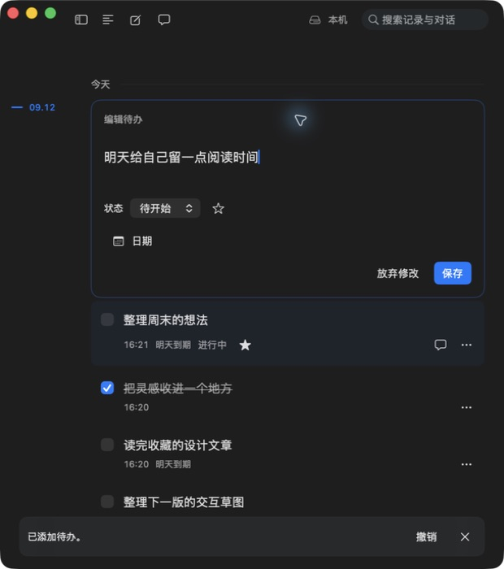

看板按三态，日历按截止日；重要与日期不混为同一属性。宽屏左右、窄屏上下沿用原始选择；日期格不塞任务摘要。原位编辑的放弃与保存语义更清楚。本轮验证点击/菜单/快捷键，未以模型测试冒充拖拽验收。

### 4. AI 闭环

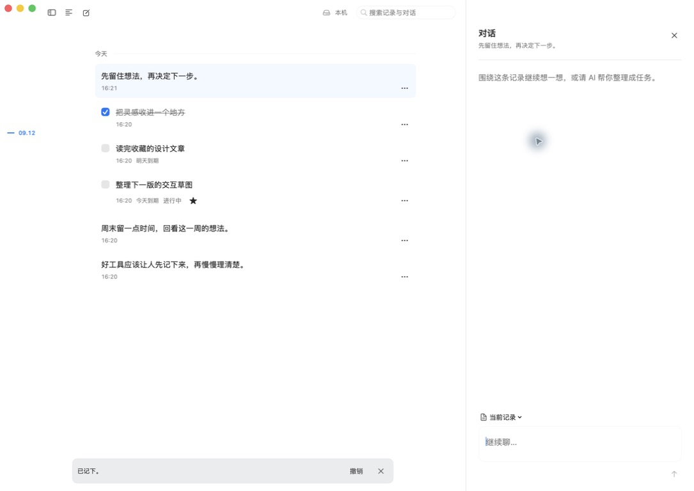

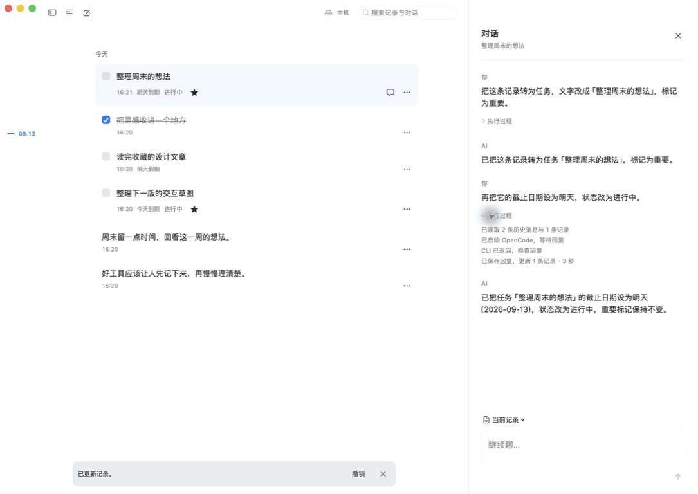

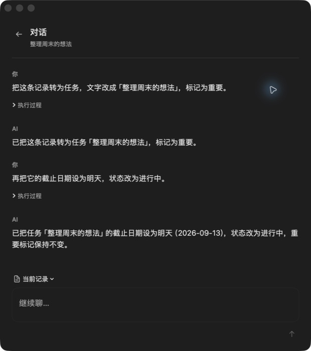

第一轮 OpenCode 把小记转为重要任务，第二轮改日期和状态；展开执行过程可看到每轮读取1条记录、CLI 启动/返回/保存。窄屏返回按钮位于左侧，正文和输入不挤在双栏中。没有伪造流式或模型内部推理。不同 CLI 的兼容性未在本轮全部复验。

### 5. 完整对话检索

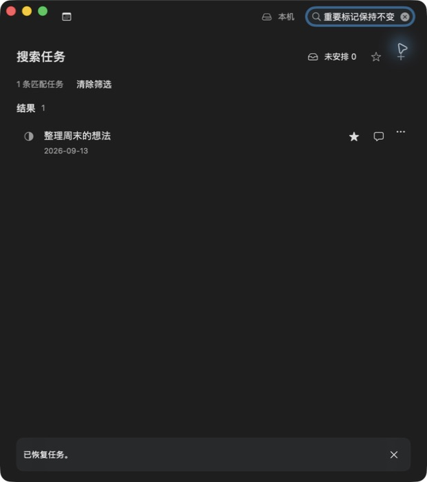

“重要标记保持不变”只存在于 AI 回复，搜索仍返回所属任务，证明记录和完整对话的关系在删除/恢复后仍完整。

### 6. 设置与恢复

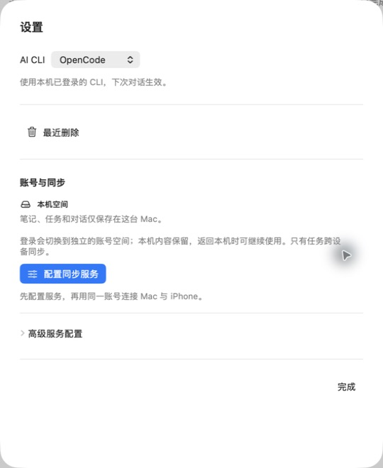

设置默认显示数据归属和登录后的结果，技术字段折叠。带对话任务删除后仍可从独立最近删除入口恢复；实际退出进程后确认过恢复入口。账号切换、导入确认与冲突文案已落地，但本轮未使用真实账号验证公网同步。

### 7. iPhone 原生编辑与设置

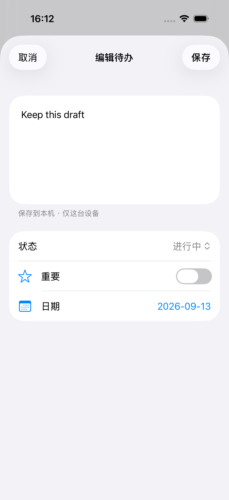

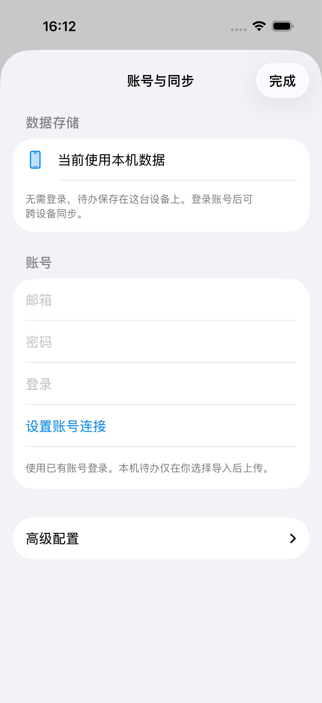

截图为本轮 XCTest 附件。编辑器内容优先，三态/重要/日期可原生操作，未保存关闭明确选择继续或放弃。设置把服务字段收进高级配置。当前截图覆盖编辑和设置，首页交互及恢复由上述模拟器用例验证。

## 明确限制

没有完成实体 iPhone、公网同步、所有 AI CLI、完整 VoiceOver、真实中文输入法候选窗和本轮原生拖拽端到端验收；这些不标记通过。测试数据库与真实账户隔离。没有修改真实同步账号配置、安装新依赖、提交或推送仓库。
